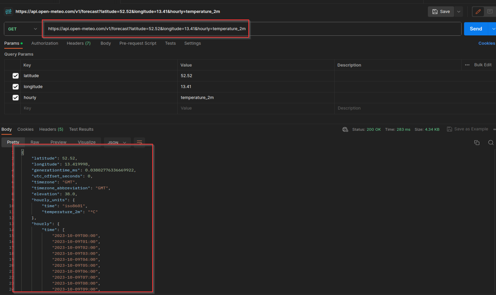
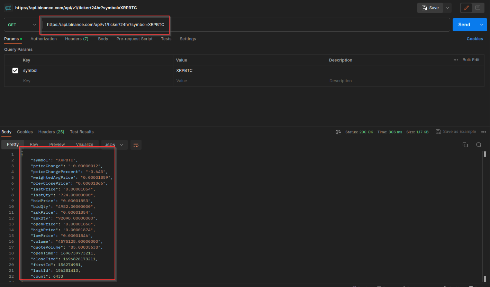

# MD5 y SHA256
 
```sh
ubuntu@ubuntu2004 ~/Pictures/background-images md5sum Galaxy.jpg
8ab9d59dab1c44cabe8d5b1d9f51b20e  Galaxy.jpg
```

```sh 
ubuntu@ubuntu2004 ~/Pictures/background-images sha256sum Galaxy.jpg
08ada8aa73cd77760b854037076ef06b26717f084ff26214725c2277010b894b  Galaxy.jpg
```

```sh
ubuntu@ubuntu2004 ~/Pictures/background-images sha256sum Galaxy_copia.jpg
08ada8aa73cd77760b854037076ef06b26717f084ff26214725c2277010b894b  Galaxy_copia.jpg
```

```sh
ubuntu@ubuntu2004 ~/Pictures/background-images md5sum Galaxy.jpg
8ab9d59dab1c44cabe8d5b1d9f51b20e  Galaxy.jpg
```

```sh
ubuntu@ubuntu2004 ~/Pictures/background-images md5sum Galaxy_copia.jpg
8ab9d59dab1c44cabe8d5b1d9f51b20e  Galaxy_copia.jpg
```

```sh
ubuntu@ubuntu2004 ~/Pictures/background-images md5sum Saturn.jpg
0edfe500b30c8507f34383d04c5836dd  Saturn.jpg
```

```sh
ubuntu@ubuntu2004 ~/Pictures/background-images sha256sum Saturn.jpg
1c88182a5d86b77d8521122297ab9f89423351036add6c121a8eb7e1b6c503fe  Saturn.jpg
```

```sh
ubuntu@ubuntu2004 ~/Desktop nano prueba_sha256.txt
```
 
```sh
ubuntu@ubuntu2004 ~/Desktop sha256sum prueba_sha256.txt
a95e79e7d2110d16968e8933abaf1bc1244df086cea41a938be087d903fbb459  prueba_sha256.txt
```

```sh
ubuntu@ubuntu2004 ~/Desktop nano prueba_sha256.txt
``` 
 
```sh
ubuntu@ubuntu2004 ~/Desktop sha256sum prueba_sha256.txt
665ea3b11ffbcb2f401a1522f94c61e25166dfa2fb1875db39c3c5293949124d  prueba_sha256.txt
```

# POSTMAN

https://api.open-meteo.com/v1/forecast?latitude=52.52&longitude=13.41&hourly=temperature_2m 


https://api.binance.com/api/v1/ticker/24hr?symbol=XRPBTC


# INVESTIGACIÓN

### Desarrollo en cascada

El desarrollo en cascada es un enfoque secuencial y lineal para el desarrollo de software, que sigue un flujo de trabajo predefinido en el que cada fase debe ser completada antes de pasar a la siguiente. Este enfoque se llama "cascada" porque el progreso del desarrollo se representa gráficamente como una cascada descendente a través de las fases del proyecto.

Las fases son las siguientes:

- Requisitos
- Diseño
- Implementación
- Pruebas
- Despliegue
- Mantenimiento


